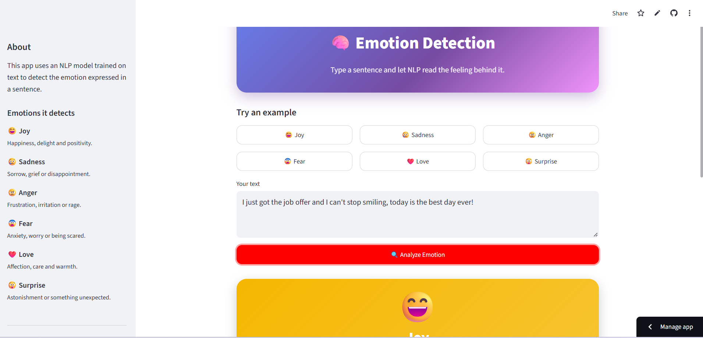

# 🧠 Emotion Detection using NLP

A Streamlit web app that reads a piece of text and predicts the emotion behind it, powered by a machine learning model trained on labelled text data.


<!-- Replace with your own screenshot or GIF -->


**🔗 Live demo:** _https://emotion-detection-using-nlp-ml.streamlit.app/_

---

## 📌 Overview

The model classifies English text into one of **six emotions**:

| Label | Emotion  | Emoji |
|-------|----------|-------|
| 0     | Sadness  | 😢 |
| 1     | Anger    | 😠 |
| 2     | Love     | ❤️ |
| 3     | Surprise | 😲 |
| 4     | Fear     | 😨 |
| 5     | Joy      | 😄 |

The app shows the **emotion name** (not the numeric label), a confidence score, and a probability chart covering all six emotions.

## ✨ Features

- Clean, modern UI with gradient header and emotion-coloured result card
- Predicted emotion shown as a name with an emoji
- Confidence score and probability chart for all six emotions
- One-click example sentences for quick testing
- Recent predictions history
- Fast loading via cached model

## 🛠️ Tech Stack

- **Language:** Python
- **Web app:** Streamlit
- **ML / NLP:** scikit-learn (text vectorization + classifier)
- **Data handling:** pandas, numpy
- **Visualisation:** Altair
- **Model persistence:** joblib

## 📂 Project Structure

```
emotion-detection-streamlit/
├── app.py                      # Streamlit app
├── emotion_classifier.joblib   # Trained model
├── requirements.txt            # Dependencies
├── README.md
├── .gitignore
├── notebooks/
│   └── emotion-detection-using-nlp.ipynb    # Training and EDA notebook
├── data/
│   └── README.md               # Dataset source
└── assets/
    └── UI.png          # App screenshot
```

## 🚀 Getting Started

### 1. Clone the repository

```bash
git clone https://github.com/sagarsingh0001/emotion-detection-streamlit.git
cd emotion-detection-streamlit
```

### 2. (Optional) Create a virtual environment

```bash
python -m venv venv
# Windows
venv\Scripts\activate
# macOS / Linux
source venv/bin/activate
```

### 3. Install dependencies

```bash
pip install -r requirements.txt
```

### 4. Run the app

```bash
streamlit run app.py
```

The app opens at `http://localhost:8501`.

## 🧪 Usage

1. Type or paste a sentence into the text box (or click an example).
2. Click **Analyze Emotion**.
3. View the predicted emotion, confidence, and probability chart.

**Example**

| Input | Output |
|-------|--------|
| "I just got the job offer and I can't stop smiling!" | 😄 Joy |
| "I can't believe they cancelled my order again." | 😠 Anger |
| "My heart is pounding, I'm terrified to look." | 😨 Fear |

## 🧠 Model Details

- **Task:** Multi-class text classification (6 classes)
- **Input:** Raw text
- **Output:** Emotion label, mapped to a name in the app:

```python
LABEL_MAP = {
    0: "sadness",
    1: "anger",
    2: "love",
    3: "surprise",
    4: "fear",
    5: "joy",
}
```

- **Training:** see `notebooks/model_training.ipynb` for preprocessing, model selection and evaluation.

> **Note:** Use the same scikit-learn version for loading as was used for training, otherwise `joblib` may raise compatibility errors.

## 📊 Results

| Metric    | Score |
|-----------|-------|
| Accuracy  | 90.5%   |
| Precision | 87.0%   |
| Recall    | 90.0%   |
| F1-score  | 88.0%   |

## 🔮 Future Improvements

- Try transformer models (BERT / DistilBERT) for higher accuracy
- Support batch prediction from CSV files
- Add multilingual emotion detection
- Deploy with Docker

## 🤝 Contributing

Contributions, issues and feature requests are welcome. Feel free to open an issue or submit a pull request.

## 👤 Author

**Sagar**

- GitHub: [@sagarsingh0001](https://github.com/sagarsingh0001)
- LinkedIn: _https://www.linkedin.com/in/sagar-singh0308/_

## 📄 License

This project is licensed under the MIT License. See the `LICENSE` file for details.

---

⭐ If you found this project useful, consider giving it a star!
